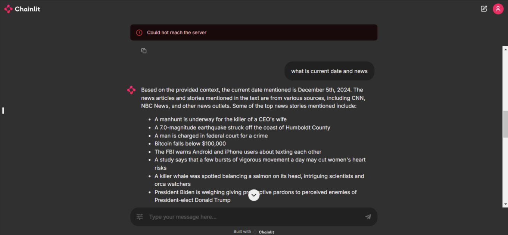

# RAG - Retrieval Augmented Generation
- **Tutorial Desktop**: [Video](https://www.linkedin.com/posts/shaik-sirajuddin-144484243_ai-machinelearning-rag-activity-7211332250167042048-3s3W?utm_source=share&utm_medium=member_desktop)  
- **Tutorial Android**: [Video](https://www.linkedin.com/posts/sirajuddin-shaik-_ai-machinelearning-rag-activity-7211332250167042048-DW9P?utm_source=share&utm_medium=member_android)  

## Overview

RAG leverages Meta Llama 3 (8B parameters) on GPU and Hugging Face API models on CPU for internet-based queries. The system supports the following key functionality:  

1. **Internet Query with LLM**: Perform web-based retrieval and engage with the retrieved content using a large language model.  



## Features  

- **Internet Query with LLM**:  
   - Search for relevant articles on the internet based on a user query.  
   - Scrape and preprocess the retrieved content.  
   - Generate contextual and insightful responses using Meta Llama 3.  

## Setup and Installation  

1. **Clone the Repository**:  

   ```bash
   git clone https://github.com/SirajuddinShaik/RAG.git
   cd RAG
   ```  

2. **Install Dependencies**:  

   ```bash
   pip install -r requirements.txt
   ```  

3. **Run the Application**:  

   ```bash
   chainlit app.py
   ```  

## Usage  

To run the application with GPU support, you can use the following Colab link:  
[Run on Colab](https://colab.research.google.com/drive/1Xgxrw3msyJZrwqJWuEipINv4k7yN2sTE?usp=sharing)  

### Example Commands  

- Start a chat session for internet queries:  

  ```bash
  chainlit app.py
  ```  

- Input your query via the web interface, and the system will handle the retrieval and response generation.  

## Project Structure  

- **app.py**: Main application script.  
- **requirements.txt**: Dependencies required for the project.  
- **src/**: Source code directory.  
- **config/**: Configuration files.  
- **src/utils/prompts/**: Various prompts used to interact.  
- **data_ingestion/**: Scripts and tools for data ingestion.  
- **logs/**: Log files.  
- **Dockerfile**: Docker setup for containerized deployment.  

## Contributing  

We welcome contributions! Please fork the repository, create a new branch, and submit a pull request.  

## License  

This project is licensed under the MIT License.  

---

If you have any questions or need further assistance, please open an issue on the GitHub repository.  

---

Happy Coding! 🚀